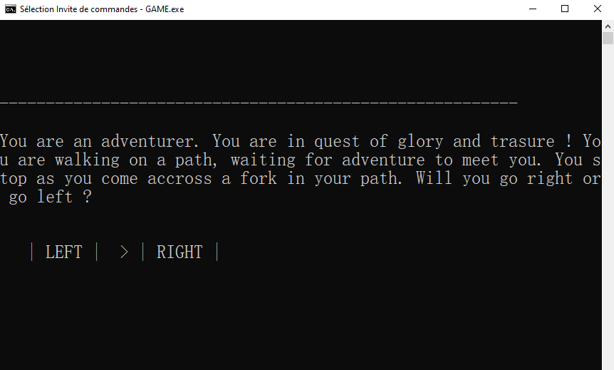
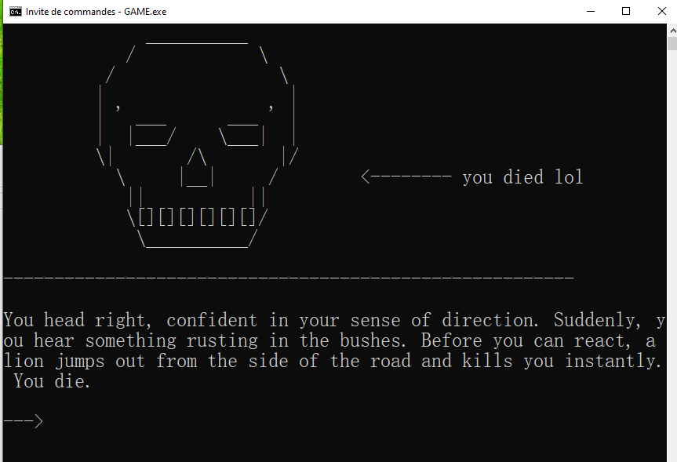
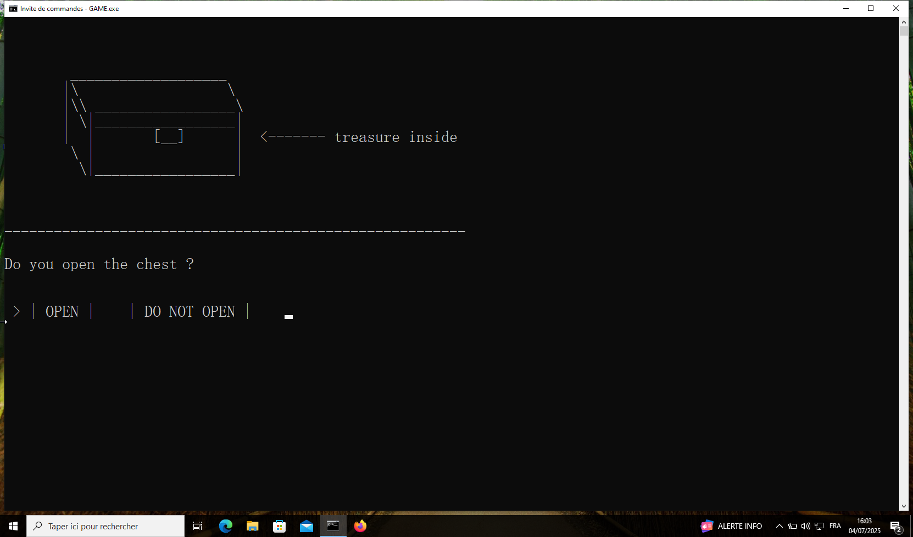
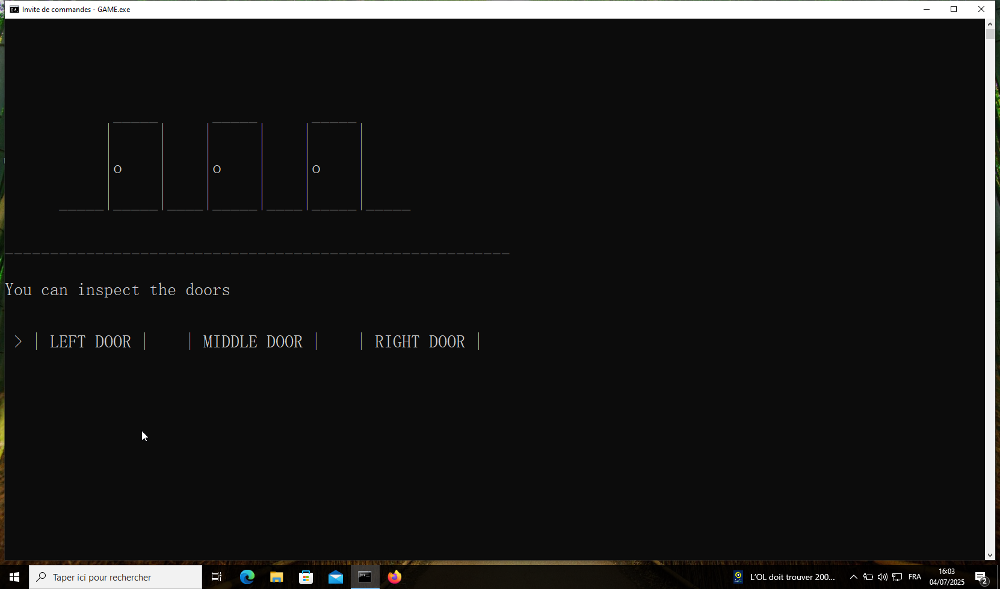
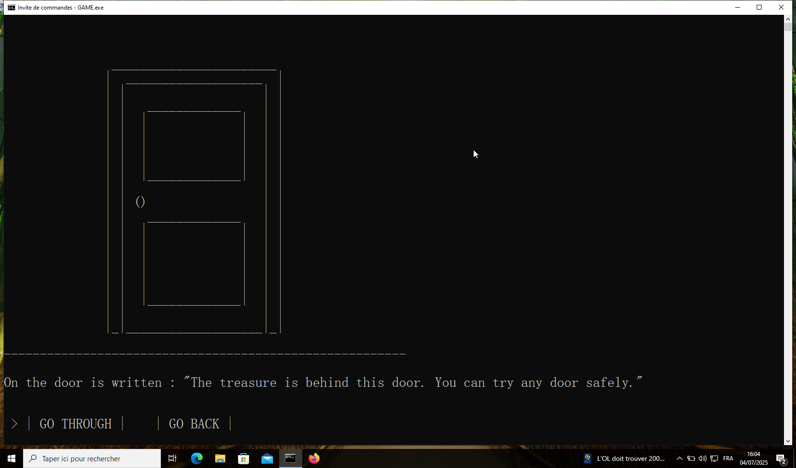

# Gamebook engine
I wanted to make a game where the player gets to make a great variety of choices, but I didn't want to have to handle an infinite else-if tree...
That's how this engine was born.

This project is inspired by [gamebooks](https://en.wikipedia.org/wiki/Gamebook) 
The `module.txt` file will tell the program what module to read. In a gamebook you would have something like "if you go right then go to page 14; if you decide to head to the left then go to page 32.". The `module.txt` file does essentially the same.

I think an example is the best way to demonstrate the principle of this (modest) game engine, so I will show you the absolute basics to make your own adventure

## A basic adventure

Let's make a simple adventure. It will have the following structure :
you are an adventurer on a road and you get to a fork in the path. If you go right you die instantly, killed by a lion. If you go left you find a cool treasure.

let's put it in practice.
first, we'll write the next needed for the adventure :


### script.txt
```
:1: intro
You are an adventurer. You are in quest of glory and trasure ! You are walking on a path, waiting for adventure to meet you. You stop as you come accross a fork in your path. Will you go right or go left ?
~
:2: right - instant death
You head right, confident in your sense of direction. Suddenly, you hear something rusting in the bushes. Before you can react, a lion jumps out from the side of the road and kills you instantly. You die.
~
:3: left - cool treasure
You head left. On the road you stumble upon an old-looking chest. You open it and see that it is filled with treasure. Hooray ! You can retire and leave this dangerous life behind you !
~
:4: "the end"
THE END
~
:-1: end of file marker
```
Then, we'll want to add images to provide a visual for the player. This is not necessary for the game, but a nice touch nonetheless.

### images.txt

```
:0: placeholder image

$
:1: death
              __________
            /            \
          /                \
         |                  |
         | ' ___      ___ ' |
         |  |___/    \___|  |
         \|       /\       |/
           \     |__|     /        <-------- you died lol
            ||          ||
            \[][][][][][]/
             \__________/
$           
:2: chest (treasure)


        ___________________
       |\                  \
       |\\ _________________\
       | \|_________________|
       |  |       [__]      |  <------- treasure inside
        \ |                 |
         \|_________________| 
          

$
:-1: end of file
```

As you can see, the file follows a certain format. The end of the image is detected when the engine reads the '$' character. This can be easily modified in the source code.

Now, we will edit the "module" file so that the program executes the correct actions.
Let's put it all together !

### module.txt
```
:0: intro

# Gives the player a choice.
# Writes entry 1 from script and displays image 0.
# Goes to module 1 or 2 depending on the choice.

D p1 i0 [LEFT] [RIGHT] m1 m2
$
:1: left (treasure)

# Reads from the script and displays an image

Z i2 p3

# after, go to module 3

M 3
$
:2: right (death)
Z i1 p2
M 3 
$
:3: the end

# just reads from the script file, no image
P 4 
$
:-1: end of file marker
```

As you can see, in each modules functions will be executed, such as "read text" or "go to module x".
These funtions are differentiated by letters and a certain syntax.
For example : 
`D p1 i0 [LEFT] [RIGHT] m1 m2`
reads text of id 1 with the image 0 and prompts the user for a choice. Depending on the choice, the engine reads either module 1 or module 2 next.

Alright, let's compile ! The ideal environment is Linux. I made adjustments so that the code can be compiled on Windows, and it works well but it hasn't been tested as extensively as in Linux.

To compile, simply enter the command `gcc general.c -o GAME`
If you do not have gcc, then install it or use any other tool you might prefer.

Then you can click on it, or execute it from the terminal directly.

### What it looks like 

In windows :





## To go further

There is a lot more to the gamebook engine : the possibility to have an inventory, to trigger events, to perform complex conditional checks, to trigger random events and to save the player progression into a file.

Let's say we want the adventure to be a little longer :
If you find the treasure and don't die, you can get an item, like a key. Then, you are faced with three doors and must solve a riddle to progress.

If you pick the right door, you win. If you don't, you die.

For this, we will add new images and text, but the most important will be the `modules.txt` file.

### updated modules.txt
```
:0: intro

D p1 i0 [LEFT] [RIGHT] m3 m1
$
:1: right (death)
Z i1 p2
M 2
$
:2: the end
# just reads from the script file, no image
P 7
$
:3: left (chest with key)

Z i2 p3 # get to the chest

#Open chest ?
D p4 i2 [OPEN] [DO NOT OPEN] m4 m5

$
:4: Get the key from the chest

Z i3 p6
O o0 v1
E e0 v1

M 6
$
:5: do not open the chest

Z i2 p5

M 6
$
:6: the three doors

# if you already saw the doors, there is less text
U e1 0 p8 i5 1 p9 i5
E e1 v1

#make your choice
Y p13 i5 [LEFT DOOR] [MIDDLE DOOR] [RIGHT DOOR] m7 m8 m9

$
:7: open L door ?
D p10 i4 [GO THROUGH] [GO BACK] m11 m6
$
:8: open M door ?
D p11 i4 [GO THROUGH] [GO BACK] m14 m6
$
:9: open R door ?
D p12 i4 [GO THROUGH] [GO BACK] m15 m6
$
:10: no key 
Z i4 p14
M 6
$
:11: L door -- starvation
H o0 v0 m10
O o0 v0
Z i0 p15
M 12
$
:12: L door -- starvation cycle
Z i0 p16
L 20 m13 m12
$
:13: L door -- death
Z i0 p17
M 2
$
:14: M door -- instant death
H o0 v0 m10
O o0 v0
Z i0 p18
M 2
$
:15: R door -- correct door
H o0 v0 m10
O o0 v0
Z i0 p19

M2
$
:-1: end of file marker
```

Let's explain the new functions.

#### Objects and inventory
```
O o0 v1
E e0 v1
```
The engine allocates memory for two arrays. One is for objects, the other is for 'events'.
These two lines change the first element of each array to one. This will be interpreted as :
Object 1 is in the inventory (the key)
Event 1 is true (the chest has been opened)

To keep track of wich index of the array represents which object or event, I recommend writing it down somewhere, like in the `events.txt` file of this repository. This file is not necessary to the engine, but useful to have nonetheless.

#### Conditional reading

```
:6: the three doors

# if you already saw the doors, there is less text
U e1 0 p8 i5 1 p9 i5
E e1 v1

#make your choice
Y p13 i5 [LEFT DOOR] [MIDDLE DOOR] [RIGHT DOOR] m7 m8 m9
$
```

This reads a different set of text+image depending on whether event 1 is true or not.
Here, there is a text to describe the doors. However when the player comes back to this place, we want the description to be shorter. Therefore in the second line we record the event 1, aka "this text has been read before".
When the player comes to this module again, event 1 will be true and a shorter description will be read.

The line `Y p13 i5 [LEFT DOOR] [MIDDLE DOOR] [RIGHT DOOR] m7 m8 m9` is a triple choice. It works the same as the first choice, but with three options. There is a version with four opions also.

#### Conditional module switch

```
:11: L door -- starvation
H o0 v0 m10
```

If the player chooses to open a door, we check if they possess the key. If they don't, we send them back to a previous module.
This line translates to `if object of id 0 has the value 0, then go to module 10`
In gamebook terms, it would be `if you don't have the key, go to page 10`

#### Randomness

```
:12: L door -- starvation cycle
Z i0 p16
L 15 m13 m12
$
```


The line `L 20 m13 m12` generates a random number between 0 and 100. If the number is lower than 15, the engine goes to module 13. Else it goes to module 12. 
This is a good way to have random events happend in your adventure.
In the context of this example :

The player keeps walking. If the random event triggers, they die. If it doesn't, the engine reads the module again and tries to trigger the random event again. From the point of view of the player, it seems like a long walk, with an eventual death.

### What does it look like ?

You can compile from this repository and see for yourself ! if you don't care about spoilers, here are some screenshots.







